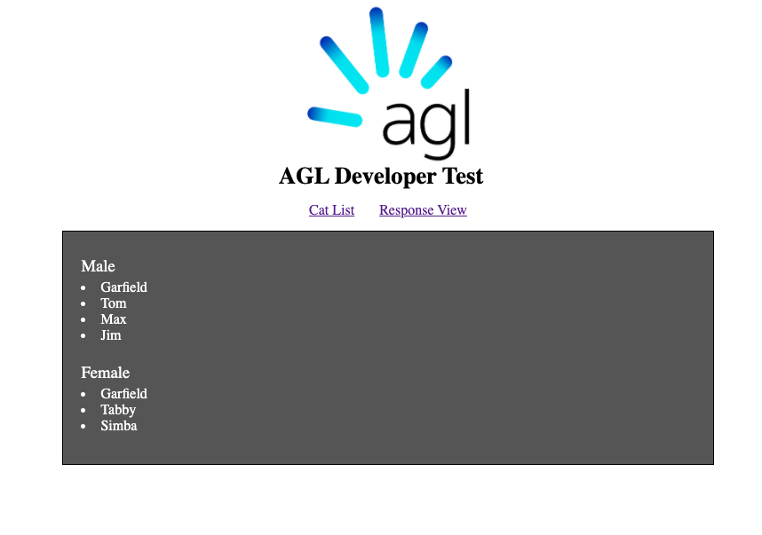

# AGL Developer Test

Ben Atkinson - 28/06/2020

### Running the demo

Run `npm run start` to start the Angular dev server, which will bundle the app and host it on `http://localhost:4200/`.  
The app will load into the cat list page, showing the output as below. I've also added an extra page to show the json response without any transformation (note I didn't add caching or refresh features so it will just call the API again on the second view. They should match if the API is stable).

### Running unit tests

Run `npm run test` to execute the unit tests via [Karma](https://karma-runner.github.io).

### Running end-to-end tests

Run `npm run e2e` to execute the end-to-end tests via [Protractor](http://www.protractortest.org/).
